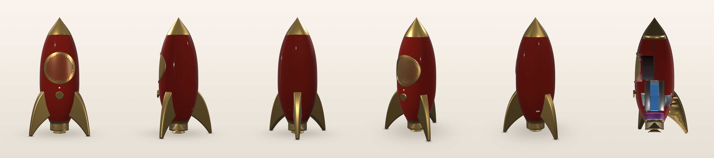

# bathsheva: ATELIER rocket speaker

A parametric 3D model of the ATELIER retro-rocket Bluetooth speaker (red body,
gold metal details), written in Python with [build123d](https://build123d.readthedocs.io).

One command regenerates everything in `output/`:

| File | What it is |
|---|---|
| `output/atelier_assembly.step` | Full assembly, one named and coloured solid per part. Send this to the industrial designer; it opens in Fusion 360, SolidWorks, Onshape, Rhino, FreeCAD... |
| `output/stl/*.stl` | One STL per visible part, already turned to a sensible print orientation and sitting on the bed (z = 0). Internal production parts (chassis, ballast) are in `stl/internal/` |
| `output/renders/*.png` | Front, side, rear, three-quarter, a cut-away section showing the internals, an overview sheet and a front/side/three-quarter sheet |
| `output/report.md` | Dimensions, internal air volume, mass against the target, centre of mass, tip-over angle, fit checks, and the assembly steps that need a professional |
| `output/print_prototype/` | Ready-to-print looks-like set: visible parts only, solid fins, no internals, plus `PRINT_NOTES.md` (material, orientation, supports per part) |
| `output/pr_comparison/` | From `python compare_pr.py`: base-firing vs rear passive radiator, renders and a numbers table |



## Setup (once, on a Mac)

You need Python 3.10–3.13. Check with `python3 --version`; if you need a newer one, `brew install python@3.12`.

```bash
cd bathsheva
python3 -m venv .venv          # a private Python install just for this project
source .venv/bin/activate      # run this in every new terminal before building
pip install -r requirements.txt
```

## Build

```bash
source .venv/bin/activate
python build.py              # everything (~2 min with the honeycomb grilles)
python build.py --no-render  # skip the PNGs when you only need the CAD
python build.py --flat       # honeycomb off for this run (much faster while iterating)
python compare_pr.py         # compare passive radiator layouts (~4 min)
```

## Changing the design

**All dimensions live in [`params.py`](params.py).** Every value has a comment.
Edit a value, save and run `python build.py`. The most useful ones:

| Want to... | Change |
|---|---|
| Make it bigger or smaller | `OVERALL_HEIGHT`, `BODY_MAX_DIA` (everything else scales) |
| Make the body fatter or slimmer at the ends | `BODY_TOP_DIA_FRAC`, `BODY_BOTTOM_DIA_FRAC` |
| Move the widest point | `BODY_MAX_AT_FRAC` |
| Make the body more egg-like or more cylindrical | `BODY_TOP_FULLNESS`, `BODY_BOTTOM_FULLNESS` (2 = egg; 3+ = straighter sides) |
| Make the nose cone longer or shorter | `CONE_HEIGHT_FRAC` |
| Make the nose cone more curved or more straight-sided | `CONE_OGIVE` (0 to 1), `CONE_TIP_HALF_ANGLE_DEG` |
| Widen the fin stance (more stable) | `FIN_TIP_REACH_FRAC` |
| Change the fin shape | `FIN_ROOT_TOP_FRAC`, `FIN_OUTER_BULGE`, `FIN_UNDERCUT`, `FIN_ROOT_THICK` |
| Change the grille size or height | `GRILLE_DIA_FRAC`, `GRILLE_Z_FRAC` |
| Turn the honeycomb on | `HEX_PATTERN_ENABLED = True` |
| Use a different driver or battery | `DRIVER_DIA`, `DRIVER_DEPTH`, `BATTERY_SIZE`, `BATTERY_MASS` |
| Change the split lines | `SPLIT_MODE` (see below) |
| Change materials (affects mass, CoM and tipping) | `PART_MATERIALS`, `MATERIAL_DENSITY` |
| Change the target weight or ballast | `TARGET_MASS_G`, `BALLAST_MASS_G` (`"auto"` sizes it to the target), ballast material in `PART_MATERIALS` |
| Move the passive radiator | `PR_POSITION` = `"base"` (down-firing, smooth back) or `"rear"` (oval behind a gold cover) |
| Change render colours and finish | `RED_HEX`, `GOLD_HEX`, `BODY_ROUGHNESS`, `BODY_CLEARCOAT`, `GOLD_ROUGHNESS` |
| Change the joint line | `JOINT_SHADOW_LINE` (0 = no line) |

`_FRAC` values are proportions, so the shape keeps its character when you
resize it. Values without `_FRAC` (wall thickness, knob, USB-C, driver) are real
physical sizes that deliberately do **not** scale.

### Split modes

| `SPLIT_MODE` | Parts of the red body | Seams on the red surface |
|---|---|---|
| `"nose_tail"` **(default)** | One shell, open top and bottom. The gold nose cone plugs in at the top and the gold foot/collar plugs in at the bottom. The battery and USB board go in from below, wiring and the knob/LED board from the top, and the driver from the front (under the grille). | None: both joints are at existing gold/red colour breaks |
| `"nose"` | One shell with a closed bottom; only the nose cone comes off | None, but everything loads through the ~49 mm top opening |
| `"fin_clamshell"` | Front shell (between the two front fins) and rear shell | Two vertical seams running up from the front fin roots. Prototype use only. |

## How the model is built (for the non-CAD person)

* **Solid of revolution:** the body and nose cone are drawn as a 2D side
  outline, then spun 360° around the vertical axis, like a pot on a lathe.
* **Shell:** a second outline 2.5 mm inside the first is spun and subtracted, leaving a hollow wall.
* **Curved front details:** the grille, bezel and recess are thin layers that follow the
  body's curve at a set depth, trimmed to a circle seen from the front, so
  they sit flush like the concept rather than as flat discs stuck on.
* **Fins:** a flat 2D crescent, thickened so it tapers towards the tip,
  edge-rounded, trimmed flush to the body and copied at 60°, 180° and 300°.
* **Boolean operations:** "add", "subtract" and "intersect" between
  solids. That's how the holes, pockets and trims are made.
* **STEP vs STL:** STEP is exact CAD geometry (true curves) for engineers.
  STL is a triangle mesh for slicers and 3D printers.

Coordinate system: Z up, ground at Z = 0, **front (grille) faces −Y**. Angles
are measured around the axis from the front.

## Internals included in the model

* **Driver mount:** the 57 mm driver is too big for the ~48–49 mm cone and collar
  openings, so it is **front-loaded**. With the grille and bezel off, it drops
  through the sound opening into a moulded well and screws onto a flat ring (4 pilot
  holes). The grille hides the screws. The report checks that the opening is big
  enough whenever you change `DRIVER_DIA` or the grille.
* **Battery:** the build tries the battery box in every orientation and keeps
  the one that sits lowest in the body. With the default 2×18650 pack, that's upright,
  standing on the foot spigot.
* **USB-C:** a stadium opening at 150° (30° off the rear fin), low down near the battery.
  It has a pocket on the inside that thins the wall to 1 mm, so a standard receptacle gets more
  plug engagement.
* **Knob:** a low 5 mm disc. A hidden 10 mm boss on its back sits in a hole in the body wall, so the
  6 mm blind shaft bore still gets about 6.5 mm of grip on the encoder shaft.
* **Passive radiator** (`PR_POSITION`):
  * `"base"` (default): a round 44 mm unit fires down through a hole in the gold collar,
    so the back stays smooth. Below the collar the base is styled as a rocket engine:
    * a ring of the front grille's honeycomb sheet, sized so its open area is at least the
      radiator's area (`PR_EXIT_AREA_RATIO`), with a gold deflector cone inside that hides
      the see-through view and turns the air outward;
    * a stepped gold nozzle carried by the ring, 2 mm off the ground. There are no posts;
      `FOOT_POSTS` can add some, hidden inside the ring.
    
    This lifts the body (see `report.md`), and the battery and ballast sit above the radiator.
  * `"rear"`: a 60 × 40 mm oval on the rear at driver height, behind a perforated
    gold cover and bezel that match the front grille.
  * `python compare_pr.py` builds both and tabulates air volume, mass, centre of
    mass, tip angle and ground clearance.
* **Ballast:** a cup round the upright battery, narrow enough to pass the collar opening.
  With `BALLAST_MASS_G = "auto"` it's sized to hit `TARGET_MASS_G`, but it never grows
  into the driver; if the target needs more than fits, the report shows the shortfall.
* **Chassis:** steel, fitted in 4 pieces, because nothing wider than the ~48–60 mm openings can
  get in. There are 3 fin brackets hugging the wall behind the fins (the fins bolt through the
  body into them with M4 bolts, heads inside) that bolt to the ballast cup, plus a
  spine behind the driver that carries the PCBs and has a tab under the driver magnet.
* **Fins:** hollow die-castings with a 3 mm wall (`FIN_WALL`), open against the body, with
  cast bosses for the bolts.
* **Fit checks:** the report checks every pair of internal items for overlaps.
* **Cut-away render** (`render_section.png`): the driver is shown in black, the battery in blue,
  the passive radiator in purple and the steel parts in grey.

## Renders

The PNGs use physically based materials: the body is oxblood lacquer
(`RED_HEX`) under a glossy clear coat, and the gold parts are fully metallic
brushed brass (`GOLD_HEX`, roughness 0.35). Metal needs something to reflect,
so `render.py` generates a small "photo studio" (soft boxes and strip lights)
as the environment. The backdrop is seamless, with soft contact shadows under the fin tips.

## 3D-printed looks-like prototype

`output/print_prototype/` holds just the visible parts, with solid fins and no internals, already
oriented for printing. `PRINT_NOTES.md` there lists the material, orientation and supports for each part.
The STLs in `output/stl/` are the production geometry (hollow fins, internals in `stl/internal/`).

## 3D-printing notes

* The STLs are already oriented; the report lists how each part lies and why.
* The body prints upside down on its top rim. The lower belly curves in like a
  dome, which most printers handle without support.
* For a looks-like model, print the gold parts in PLA, then sand, prime and paint (or use gold PLA).
  Sand and prime the body, then gloss it with automotive red and clear coat.
* The printed fins are much lighter than zinc, so a printed prototype has a
  higher centre of mass than the report states. The report assumes production materials.
  To see the prototype numbers, set every entry in `PART_MATERIALS` to `"pla"`.

## Project layout

```
params.py      all dimensions and materials  <- edit this
model.py       geometry (build123d)
analysis.py    air volume, mass, centre of mass, tip angle
render.py      PNG previews (PyVista)
build.py       runs everything and writes output/
```
